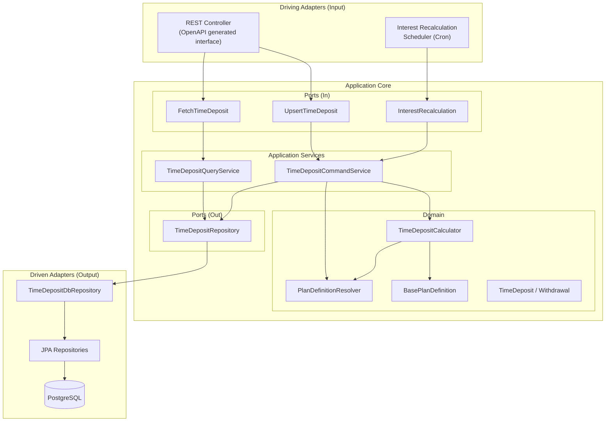
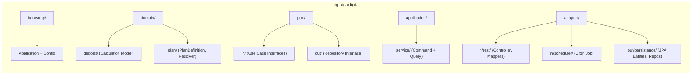
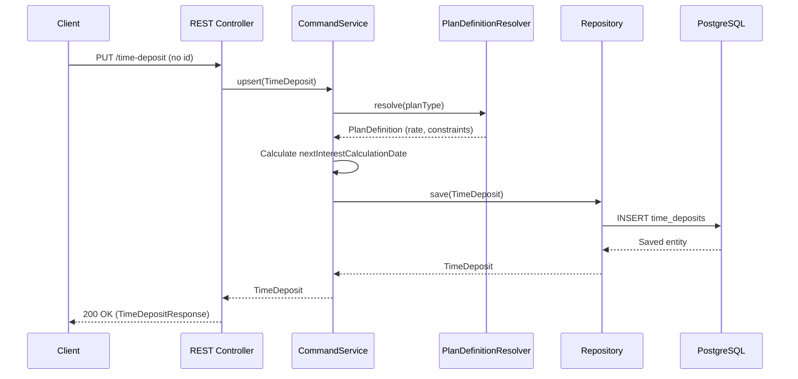
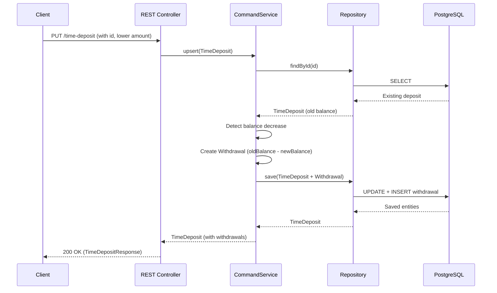
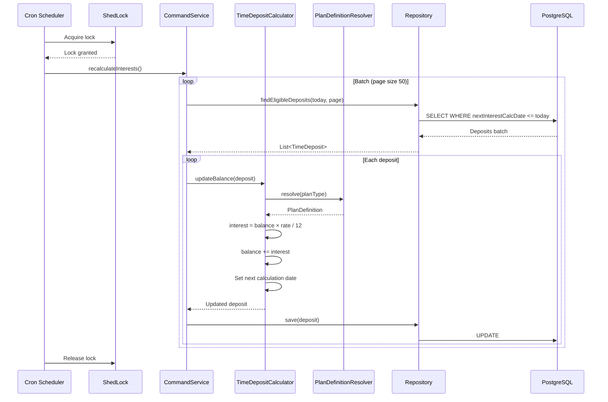
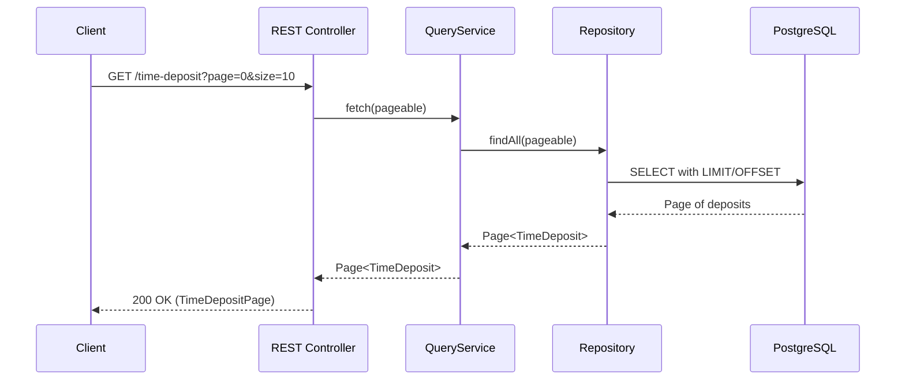
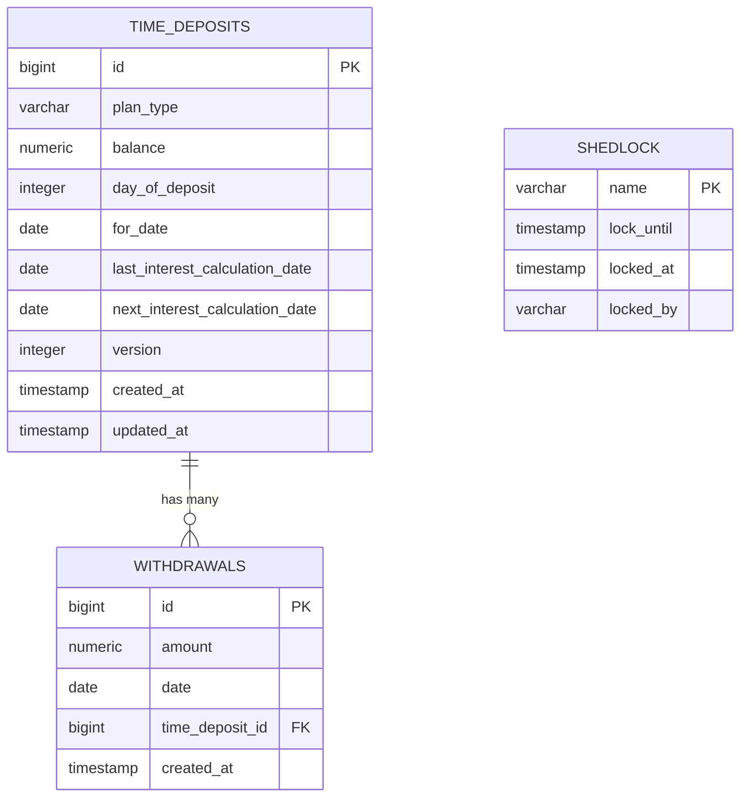

# Technical Documentation — Time Deposit Application

## Project Background

This application is a **Time Deposit Management System** for XA Bank, developed as a take-home kata exercise. It manages fixed-term bank deposits with plan-specific monthly interest calculation. The system supports creating and updating time deposits, tracking withdrawals, and automatically recalculating interest on a nightly schedule.

### Business Domain

Customers hold **time deposits** characterized by a plan type, initial balance, and duration. The system supports three plan types with distinct interest rules:

| Plan Type | Annual Rate | Interest Starts After | Interest Stops After |
|-----------|-------------|----------------------|---------------------|
| Basic     | 1%          | 30 days              | Never               |
| Student   | 3%          | 30 days              | 366 days            |
| Premium   | 5%          | 45 days              | Never               |

Interest is calculated monthly using the formula: `balance × rate / 12`, rounded to 2 decimal places.

---

## Technology Stack

| Category          | Technology                              |
|-------------------|-----------------------------------------|
| Language          | Kotlin 2.2.0 (JVM 17)                  |
| Framework         | Spring Boot 4.0.7                       |
| Build Tool        | Apache Maven                            |
| Web Layer         | Spring WebMVC                           |
| Persistence       | Spring Data JPA + Hibernate             |
| Database          | PostgreSQL                              |
| Migrations        | Liquibase                               |
| API Contract      | OpenAPI 3.0 + OpenAPI Generator (kotlin-spring, delegate pattern) |
| API Documentation | springdoc-openapi 3.0.2 (Swagger UI)    |
| Scheduling        | Spring `@Scheduled` + ShedLock 6.3.1    |
| Serialization     | Jackson (Kotlin module + JSR-310)       |
| Testing           | JUnit 5, AssertJ, Spring Boot Test, MockMvc, Testcontainers |
| Containerization  | Docker Compose (PostgreSQL)             |

---

## Architecture

The project follows **Hexagonal Architecture** (Ports & Adapters), ensuring clean separation between business logic and infrastructure concerns.

### Architecture Diagram



### Package Structure



---

## Main Flows

### 1. Create Time Deposit



### 2. Update Time Deposit (with Withdrawal)



### 3. Interest Recalculation (Scheduled Job)



### 4. Fetch Time Deposits (Paginated)



---

## Database Schema



---

## API Specification

The REST API is defined using **OpenAPI 3.0** specification (`src/main/resources/openapi/time-deposit-api.yml`). Code generation produces:
- Controller interface (`TimeDepositApi`)
- Request/Response DTOs (`TimeDepositRequest`, `TimeDepositResponse`, `TimeDepositPage`)

Swagger UI is available at runtime: `http://localhost:8080/swagger-ui/index.html`

---

## Configuration

Plan definitions and interest rules are externalized in `application.yaml`, making them easy to modify without code changes:

```yaml
time-deposit:
  plans:
    basic:    { interest-rate: 0.01, first-interest-calculation-day: 30 }
    student:  { interest-rate: 0.03, first-interest-calculation-day: 30, last-interest-calculation-day: 366 }
    premium:  { interest-rate: 0.05, first-interest-calculation-day: 45 }
```

The interest recalculation schedule is also configurable:
```yaml
interest-recalculation:
  cron: '0 0 0 * * *'   # daily at midnight
```
